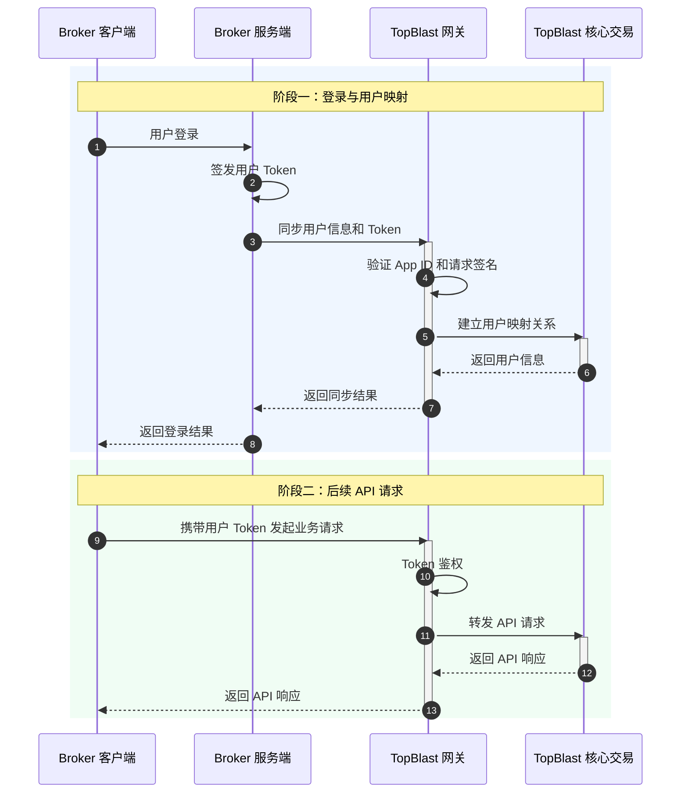
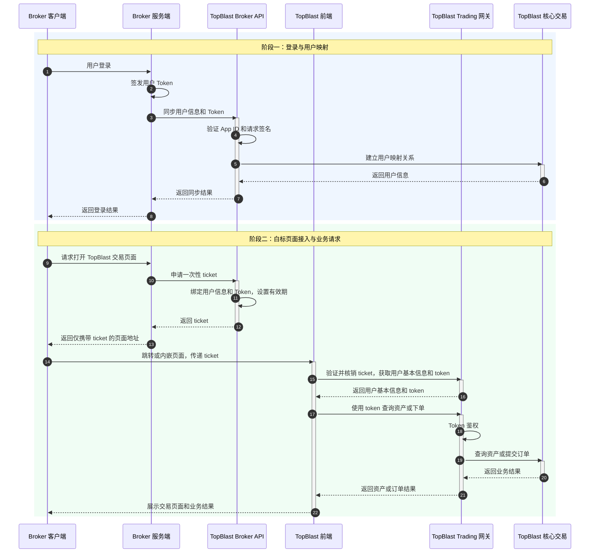

TopBlast 提供 API 接入和白标接入两种方式。两种方式共享登录与用户映射流程，区别在于交易页面的提供方和后续业务请求的发起方。

## 接入方式

| 接入方式 | 交易页面 | 阶段二调用方式 | 适用场景 |
| :--- | :--- | :--- | :--- |
| API 接入 | 由券商开发和维护 | 券商客户端携带用户 Token，直接调用 TopBlast API | 自定义交易界面和交互体验 |
| 白标接入 | 由 TopBlast 提供 | 券商申请一次性 `ticket`，由 TopBlast 前端兑换后发起业务请求 | 快速使用 TopBlast 提供的交易页面 |

## API 接入流程

券商用户登录成功后，券商服务端调用 `POST /v1/broker/tokens`，将 `brokerUserId`（券商系统中的用户 ID）和 Token 同步到 TopBlast。如果用户映射不存在，TopBlast 会在同步过程中自动创建。后续响应中的 `userId` 表示平台用户 ID。

完成用户映射后，券商客户端携带用户 Token，直接调用 TopBlast API 查询资产、下单或发起其他业务请求。



## 白标接入流程

白标接入由 TopBlast 提供完整的交易页面，券商无需自行开发交易前端。

第一阶段与 API 接入相同。阶段二由券商服务端向 TopBlast 申请短时、一次性有效的 `ticket`。券商通过页面跳转或内嵌方式打开 TopBlast 交易页面，并在 URI 中仅传递 `ticket`：

```text
https://www-dev.topblast.trade?ticket={ticket}
```

TopBlast 前端使用 `ticket` 换取用户基本信息和 `token`。兑换成功后，`ticket` 立即失效。TopBlast 前端使用返回的 `token` 查询用户资产和发起下单请求。

票据兑换结果包含以下信息：

```json
{
  "appid": "...",
  "userId": "...",
  "token": "...",
  "email": "...",
  "brokerUserId": "..."
}
```



<Warning>
请始终使用 HTTPS。`ticket` 必须短时有效且只能成功兑换一次。不要在 URI 中传递用户 Token 或 App Secret。
</Warning>
