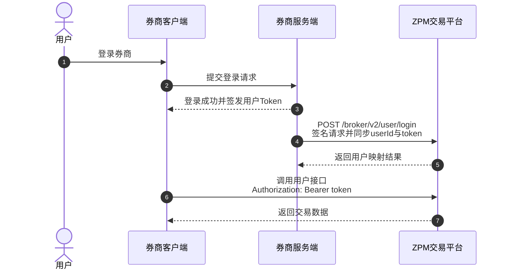

欢迎使用 ZPM OpenAPI。本文档面向接入 ZPM 交易平台的券商（Broker）及合作方。

完成接入后，您可以：

1. **同步用户**：将券商用户映射到 ZPM，并同步用户访问 Token。
2. **划转资产**：为券商用户发起充值或提现，并查询划转记录。
3. **查询与管理交易**：查询用户的成交、持仓和委托，并执行撤单、平仓等操作。

## 接口类型

ZPM OpenAPI 分为两类接口。请根据调用方选择正确的鉴权方式。

| 接口类型 | 路径范围 | 调用方 | 鉴权方式 |
| :--- | :--- | :--- | :--- |
| 券商接口 | `/broker/v2/*` | 券商服务端 | API Key、时间戳和 HMAC-SHA256 签名 |
| 用户接口 | `/api/v1/trade/*` | 已登录的终端用户 | Bearer Token |

<Warning>
请仅在券商服务端保存 API Secret。不要将 API Secret 暴露给浏览器、移动客户端或终端用户。
</Warning>

## 接入前准备

开始联调前，请向 ZPM 获取券商级 `API Key` 和 `API Secret`，并确认已开通测试环境访问权限。

所有券商接口请求都必须携带以下 Header：

- `x-api-key`
- `x-timestamp`
- `x-signature`

签名规则和代码示例请参阅[券商接口鉴权](/cn/broker/guide/authentication)。

## 标准接入流程

用户在券商侧登录成功后，券商服务端调用 `POST /broker/v2/user/login`，将券商侧用户 ID 和用户 Token 同步到 ZPM。如果用户映射不存在，ZPM 会在登录过程中自动创建。



### 1. 同步用户和 Token

券商服务端在用户登录后调用：

```http
POST /broker/v2/user/login HTTP/1.1
Content-Type: application/json
x-api-key: <broker_api_key>
x-timestamp: <timestamp>
x-signature: <signature>

{
  "userId": "broker-user-10001",
  "userName": "alice",
  "email": "alice@example.com",
  "token": "<user_access_token>"
}
```

其中 `userId` 和 `token` 为必填字段。`userId` 是用户在券商系统中的唯一标识；后续券商接口继续使用该标识定位用户。

<Note>
再次调用登录接口会同步最新的用户信息和 Token。用户退出券商后，请调用 `POST /broker/v2/user/logout` 同步登出状态。
</Note>

### 2. 划转资产

使用 `POST /broker/v2/transfer` 发起充值或提现。请求中的 `txnId` 必须唯一，以便查询和追踪划转记录。

- `direction: 1` 表示充值
- `direction: 2` 表示提现
- 当前支持的币种以[创建券商用户划转](/cn/broker/api-reference/transfer/create)中的接口定义为准

您可以通过[划转列表](/cn/broker/api-reference/transfer/list)和[划转详情](/cn/broker/api-reference/transfer/detail)查询处理结果。

### 3. 调用交易接口

用户使用登录流程中同步的 Token 调用用户接口：

```http
Authorization: Bearer <user_access_token>
```

用户接口可用于查询现货和合约的委托、成交、持仓及账单。完整规则请参阅[用户接口鉴权](/cn/client/guide/authentication)。券商服务端也可以通过[券商交易接口](/cn/broker/api-reference/trade/trades)查询和管理其用户的交易数据。

## API 网关地址

| 环境 | 网关地址 |
| :--- | :--- |
| 测试环境 | `http://10.10.1.10:38008` |

将网关地址与接口路径拼接即可得到完整请求地址。例如：

```text
http://10.10.1.10:38008/broker/v2/user/login
```

## 下一步

<CardGroup cols={3}>
  <Card title="配置鉴权" icon="key" href="/guide/authentication-b">
    生成券商接口签名并验证请求。
  </Card>
  <Card title="同步用户" icon="user" href="/api-reference/broker/user/login">
    查看登录接口的完整请求定义。
  </Card>
  <Card title="发起划转" icon="arrow-right-arrow-left" href="/api-reference/broker/transfer/create">
    为券商用户充值或提现。
  </Card>
</CardGroup>
