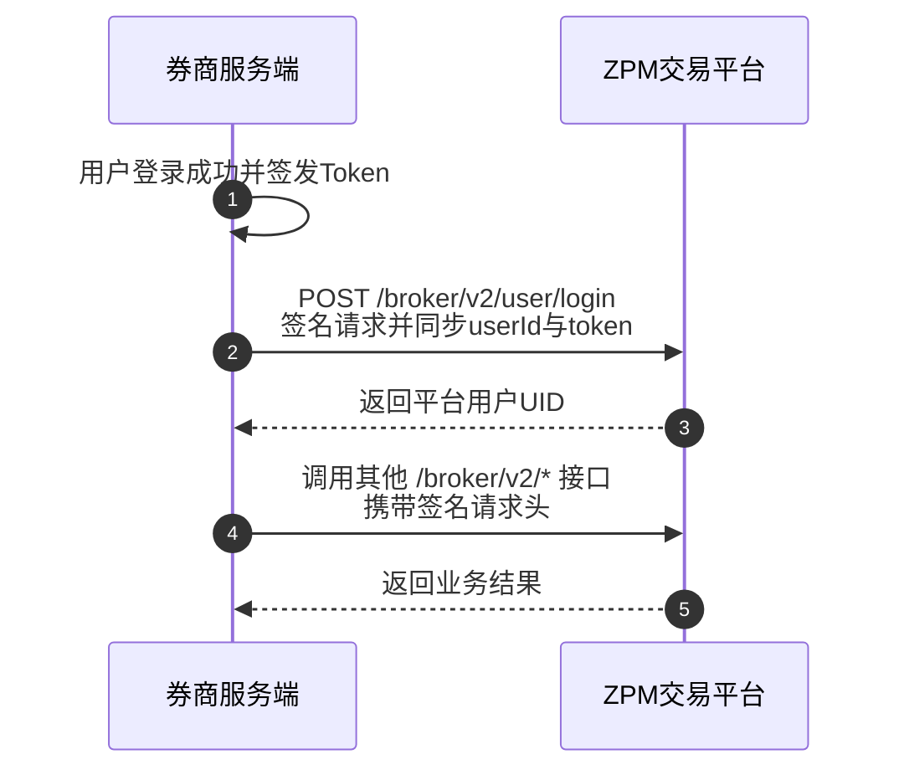

欢迎使用 ZPM OpenAPI。本文档面向通过服务端接入 ZPM 交易平台的券商及合作方，介绍 Broker API 的签名鉴权、业务接入流程和接口能力。

## 接口能力

完成接入后，券商服务端可以使用 Broker API 管理以下业务：

1. **用户管理**：建立券商用户与 ZPM 用户的映射，同步登录 Token 和登出状态，更新用户信息，创建特殊账户，并查询券商名下的用户列表。
2. **资产管理**：为券商用户发起充值或提现，查询划转列表和划转详情，并查看用户资产及余额信息。
3. **交易管理**：查询券商用户的成交记录、仓位和当前委托，并执行撤单、平仓等交易操作。
4. **报表分析**：查询汇总报表、趋势报表、每日业务汇总和仪表盘数据，了解用户增长、活跃情况、资金流动及成交规模。
5. **事件管理**：查询平台事件及其市场信息，按券商业务需要启用或停用事件，控制可运营的事件范围。
6. **风控管理**：查询风控策略和风险敞口，读取或保存全局及事件级风控配置，控制最大最坏情况赔付额等风险指标。

所有接口均位于 `/broker/v2/*` 路径下，只能由券商服务端调用。请求通过 API Key、时间戳和 HMAC-SHA256 签名完成身份验证，并且只能访问当前券商权限范围内的数据。

<Warning>
请仅在券商服务端保存 API Secret。不要将 API Secret 暴露给浏览器、移动客户端或终端用户。
</Warning>

## 接入前准备

开始联调前，请向 ZPM 获取券商级 `API Key` 和 `API Secret`，并确认已开通测试环境访问权限。

所有券商接口请求都必须携带以下 Header：

- `x-api-key`
- `x-timestamp`
- `x-signature`

签名规则和代码示例请参阅[券商接口鉴权](/cn/broker/guide/authentication)。

## 标准接入流程

券商用户登录成功后，券商服务端调用 `POST /broker/v2/user/login`，将券商侧用户 ID 和 Token 同步到 ZPM。如果用户映射不存在，ZPM 会在登录过程中自动创建。

## API 网关地址

| 环境 | 网关地址 |
| :--- | :--- |
| 开发环境 | `https://predict.xbit.trade` |
| 测试环境 | `https://apitest-predict.xbit.trade` |
| 生产环境 | `暂不提供` |

## 下一步

<CardGroup cols={3}>
  <Card title="配置鉴权" icon="key" href="/cn/broker/guide/authentication">
    生成券商接口签名并验证请求。
  </Card>
  <Card title="同步用户" icon="user" href="/cn/broker/api-reference/user/login">
    查看登录接口的完整请求定义。
  </Card>
  <Card title="发起划转" icon="arrow-right-arrow-left" href="/cn/broker/api-reference/transfer/create">
    为券商用户充值或提现。
  </Card>
</CardGroup>
