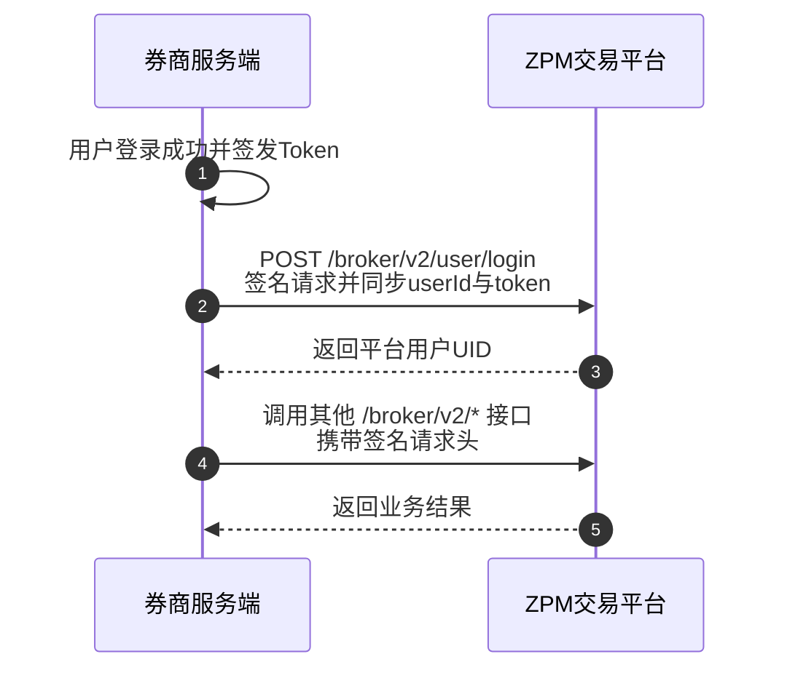

欢迎使用 ZPM OpenAPI，本文档面向通过服务端接入 ZPM 交易平台的券商及合作方。了解 ZPM OpenAPI 的接入流程，包括签名鉴权、用户同步、资产划转和交易管理等等。

完成接入后，您可以：

1. **用户管理**：将券商用户映射到 ZPM，并同步用户访问 Token。
2. **资产管理**：为券商用户发起充值或提现，并查询划转记录。
3. **交易管理**：查询券商用户的成交、仓位和委托，并执行撤单、平仓等操作。

<Warning>
请仅在券商服务端保存 API Secret。不要将 API Secret 暴露给浏览器、移动客户端或终端用户。
</Warning>

## 接入前准备

开始联调前，请向 ZPM 获取券商级 `API Key` 和 `API Secret`，并确认已开通测试环境访问权限。

所有券商接口请求都必须携带以下 Header：

- `x-api-key`
- `x-timestamp`
- `x-signature`

签名规则和代码示例请参阅[券商接口鉴权](/cn/broker/guide/authentication)。

## 标准接入流程

券商用户登录成功后，券商服务端调用 `POST /broker/v2/user/login`，将券商侧用户 ID 和 Token 同步到 ZPM。如果用户映射不存在，ZPM 会在登录过程中自动创建。



### 1. 同步用户和 Token

券商服务端在用户登录后调用：

```http
POST /broker/v2/user/login HTTP/1.1
Content-Type: application/json
x-api-key: <broker_api_key>
x-timestamp: <timestamp>
x-signature: <signature>

{
  "userId": "broker-user-10001",
  "userName": "alice",
  "email": "alice@example.com",
  "token": "<user_access_token>"
}
```

其中 `userId` 和 `token` 为必填字段。`userId` 是用户在券商系统中的唯一标识；后续券商接口继续使用该标识定位用户。

<Note>
再次调用登录接口会同步最新的用户信息和 Token。用户退出券商后，请调用 `POST /broker/v2/user/logout` 同步登出状态。
</Note>

### 2. 划转资产

使用 `POST /broker/v2/transfer` 发起充值或提现。请求中的 `txnId` 必须唯一，以便查询和追踪划转记录。

- `direction: 1` 表示充值
- `direction: 2` 表示提现
- 当前支持的币种以[创建划转](/cn/broker/api-reference/transfer/create)中的接口定义为准

您可以通过[划转列表](/cn/broker/api-reference/transfer/list)和[划转详情](/cn/broker/api-reference/transfer/detail)查询处理结果。

### 3. 管理交易

券商服务端继续使用相同的签名鉴权方式调用交易管理接口。您可以查询券商用户的成交记录、仓位和当前委托，也可以执行撤单和平仓。

- [查询成交记录](/cn/broker/api-reference/trade/trades)
- [查询仓位](/cn/broker/api-reference/trade/positions)
- [查询当前委托](/cn/broker/api-reference/trade/open-orders)
- [取消委托](/cn/broker/api-reference/trade/cancel-orders)
- [平仓](/cn/broker/api-reference/trade/close-position)

所有操作都必须使用当前券商的 API Key 签名，并且只能访问归属于当前券商的用户数据。

## API 网关地址

| 环境 | 网关地址 |
| :--- | :--- |
| 测试环境 | `http://10.10.1.10:38008` |

将网关地址与接口路径拼接即可得到完整请求地址。例如：

```text
http://10.10.1.10:38008/broker/v2/user/login
```

## 下一步

<CardGroup cols={3}>
  <Card title="配置鉴权" icon="key" href="/cn/broker/guide/authentication">
    生成券商接口签名并验证请求。
  </Card>
  <Card title="同步用户" icon="user" href="/cn/broker/api-reference/user/login">
    查看登录接口的完整请求定义。
  </Card>
  <Card title="发起划转" icon="arrow-right-arrow-left" href="/cn/broker/api-reference/transfer/create">
    为券商用户充值或提现。
  </Card>
</CardGroup>
