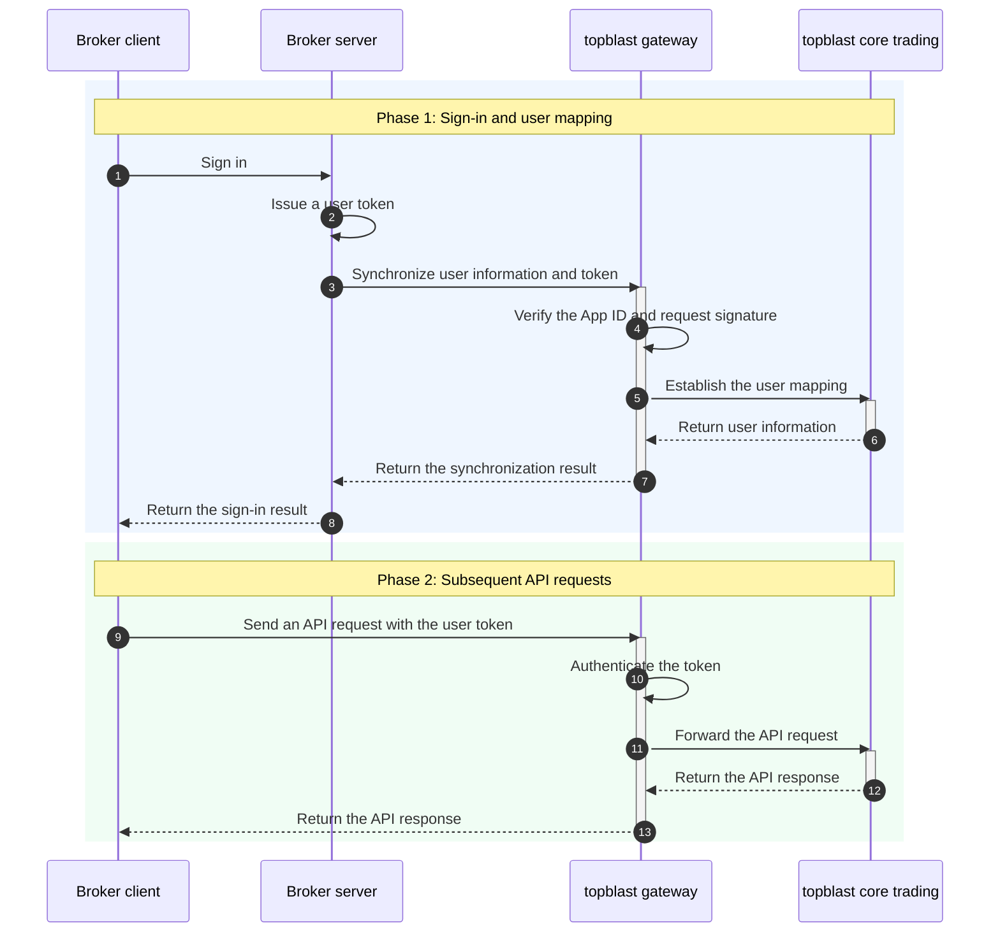
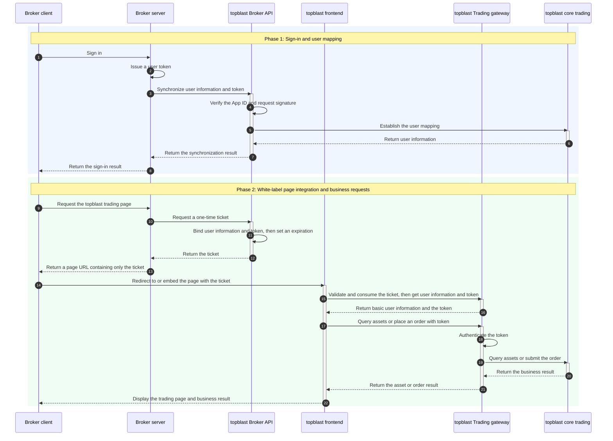

Topblast provides API integration and white-label integration. Both approaches share the same sign-in and user-mapping flow. They differ in who provides the trading page and initiates subsequent business requests.

## Integration approaches

| Integration | Trading page | Phase 2 requests | Best suited for |
| :--- | :--- | :--- | :--- |
| API integration | Developed and maintained by the broker | The broker client sends the user token directly to topblast APIs | Custom trading interfaces and user experiences |
| White-label integration | Provided by topblast | The broker requests a one-time `ticket`, which the topblast frontend exchanges before making business requests | Quick adoption of the trading page provided by topblast |

## API integration flow

After a broker user signs in, call `POST /v1/broker/tokens` from the broker server to synchronize `brokerUserId`—the user ID in the broker system—and the token with topblast. Topblast automatically creates the mapping if it does not exist. In subsequent responses, `userId` identifies the platform user.

After the user mapping is established, the broker client sends the user token directly to the topblast API to query assets, place orders, or make other business requests.



## White-label integration flow

With white-label integration, topblast provides the complete trading page, so the broker does not need to develop its own trading frontend.

Phase 1 is the same as the API integration flow. In phase 2, the broker server requests a short-lived, one-time `ticket` from topblast. The broker redirects users to or embeds the topblast trading page and passes only the `ticket` in the URI:

```text
https://www-dev.topblast.trade?ticket={ticket}
```

The topblast frontend exchanges the `ticket` for basic user information and a `token`. The `ticket` becomes invalid immediately after a successful exchange. The frontend uses the returned `token` to query user assets and place orders.

The ticket exchange result contains:

```json
{
  "appid": "...",
  "userId": "...",
  "token": "...",
  "email": "...",
  "brokerUserId": "..."
}
```



<Warning>
Always use HTTPS. The `ticket` must be short-lived and successfully exchanged only once. Never pass the user token or App Secret in the URI.
</Warning>
