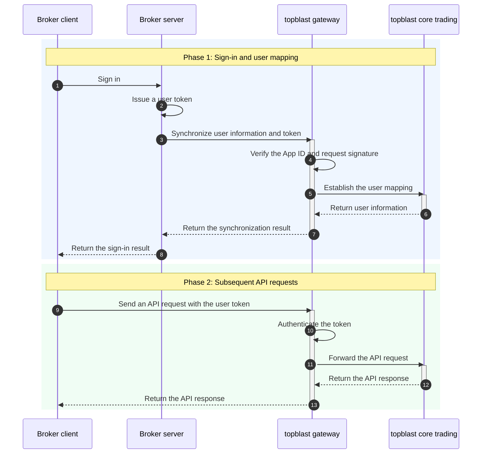
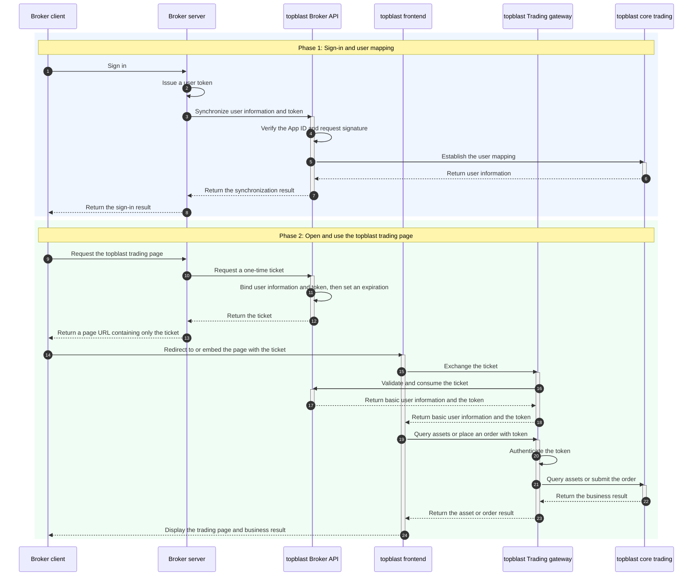

Topblast provides API integration and white-label integration. With either approach, phase 1 consists of signing the user in and synchronizing the user information and token with topblast. Phase 2 depends on the integration approach.

After a broker user signs in, call `POST /v1/broker/tokens` from the broker server to synchronize `brokerUserId`—the user ID in the broker system—and the token with topblast. topblast automatically creates the mapping if it does not exist. In subsequent responses, `userId` identifies the platform user.

## Integration approaches

The two approaches differ primarily in who provides the trading page and how phase 2 requests are made:

| Integration | Trading page | Phase 2 requests | Best suited for |
| :--- | :--- | :--- | :--- |
| API integration | Developed and maintained by the broker | The broker client sends the user token directly to topblast APIs to query assets, place orders, and perform other trading operations | Brokers that need full control over the trading interface and user experience, including a custom trading page |
| White-label integration | Provided by topblast | The broker server requests a one-time `ticket`, then redirects users to or embeds the topblast trading page with only the `ticket`. The topblast frontend exchanges the `ticket` before querying assets or placing orders | Brokers that want to launch quickly with the trading page provided by topblast |

## API integration flow

With API integration, the broker client sends the user token directly to the topblast API during phase 2 to query assets, place orders, or make other business requests.



## White-label integration flow

With white-label integration, topblast provides the complete trading page, so the broker does not need to develop its own trading frontend. If the broker develops a custom trading page, follow the API integration flow above and call the relevant business APIs.

Phase 1 is the same as the API integration flow. In phase 2, the broker server requests a short-lived, one-time `ticket` from topblast. The broker redirects users to or embeds the topblast trading page and passes only the `ticket` in the URI:

```text
https://www-dev.topblast.trade?ticket={ticket}
```

The topblast frontend exchanges the `ticket` for basic user information and a `token`. The `ticket` becomes invalid immediately after a successful exchange. The frontend uses the returned `token` to query user assets and place orders.

The ticket exchange result contains:

```json
{
  "appid": "...",
  "userId": "...",
  "token": "...",
  "email": "...",
  "brokerUserId": "..."
}
```



<Warning>
Always use HTTPS. The `ticket` must be short-lived and successfully exchanged only once. Never pass the user token or App Secret in the URI.
</Warning>
