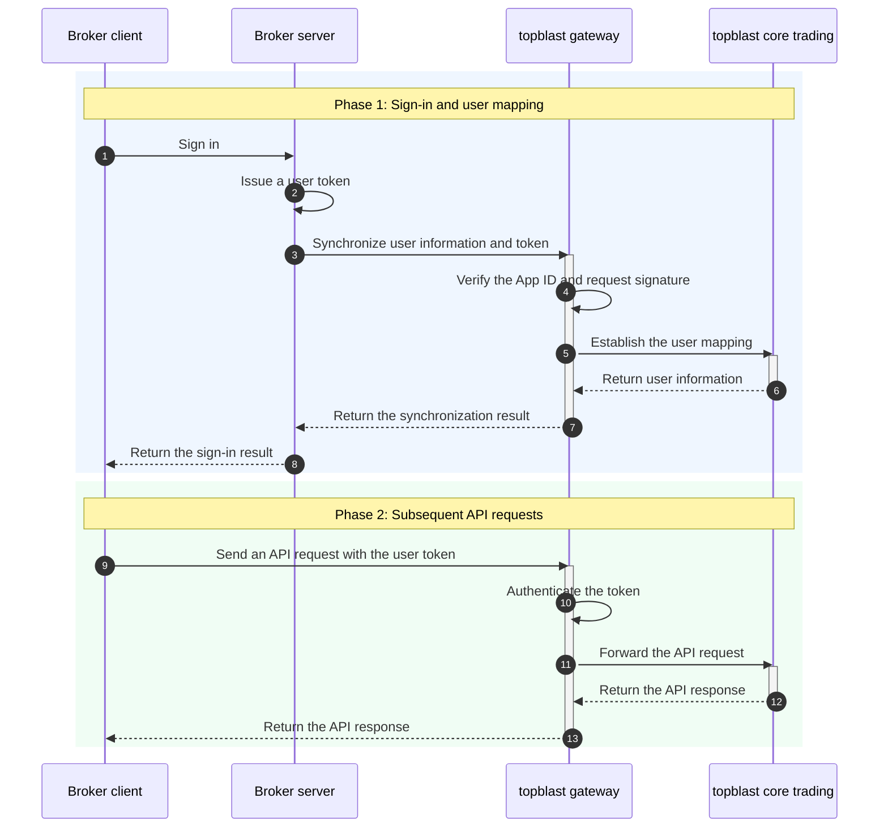

Welcome to the Broker REST API. This documentation is for brokers and partners integrating with the topblast trading platform from their servers. It explains signature authentication, integration flows, and available capabilities.

## Capabilities

After integration, your broker server can use the Broker REST API to manage:

1. **Users**: Map broker users to topblast users, synchronize login tokens and logout state, update user details, create special accounts, and list users under the broker.
2. **Assets**: Create deposits or withdrawals, query transfer records and details, and retrieve user assets and balances.
3. **Trading**: Query trades, positions, and open orders, and perform actions such as canceling orders and closing positions.
4. **Reports**: Retrieve summary, trend, daily summary, and dashboard data for user growth, activity, fund flows, and trading volume.
5. **Events**: Query platform events and markets, and enable or disable events or individual markets for the broker.
6. **Risk management**: Query policies and exposures, and read or save global and event-level risk settings to control metrics such as maximum worst-case payout.
7. **Webhooks**: Subscribe to broker events through one callback URL and process status changes in your application.

All endpoints use the `/v1/broker/*` prefix and must be called from the broker server. Requests are authenticated with an App ID, timestamp, and HMAC-SHA256 signature and can access only data within the current broker's scope.

<Warning>
Store the App Secret on the broker server only. Never expose it to browsers, mobile clients, or end users.
</Warning>

## API gateway

| Environment | Gateway |
| :--- | :--- |
| Test | `https://api-test.topblast.trade` |

## Prerequisites

Before integration testing, obtain a broker-level `App ID` and `App Secret` from topblast and confirm that test-environment access is enabled.

Every Broker REST API request must include:

- `x-app-id`
- `x-timestamp`
- `x-signature`

See [Authorization and signatures](/en/broker/guide/authentication) for signature rules and code examples.

## User integration flow

After a broker user signs in, call `POST /v1/broker/tokens` from the broker server to synchronize `brokerUserId`—the user ID in the broker system—and the token with topblast. topblast automatically creates the mapping if it does not exist. In subsequent responses, `userId` identifies the platform user.

## Next steps

<CardGroup cols={3}>
  <Card title="Configure authentication" icon="key" href="/en/broker/guide/authentication">
    Generate and verify Broker REST API signatures.
  </Card>
  <Card title="Synchronize a user" icon="user" href="/en/broker/api-reference/user/login">
    Review the complete login endpoint.
  </Card>
  <Card title="Create a transfer" icon="arrow-right-arrow-left" href="/en/broker/api-reference/transfer/create">
    Deposit or withdraw assets for a user.
  </Card>
</CardGroup>
