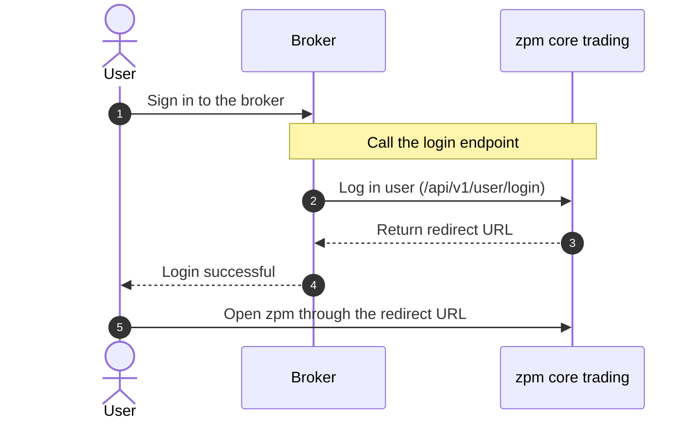

Welcome to the zpm API documentation. This documentation helps brokers integrate with the zpm trading system.

You can use these APIs to:

1. **Synchronize users**: Map users from your system to the zpm core trading system.
2. **Transfer assets**: Move funds between broker accounts and the trading platform in real time.
3. **Manage API keys**: Create and manage trading credentials for your end users.

## User integration flow

The following diagram shows how a user accesses zpm core trading through a broker:

## API gateway

Use the gateway for your current integration environment.

| Environment | Gateway |
| :--- | :--- |
| **Test** | `http://10.10.1.10:38008` |

## Quick navigation

- <Icon icon="rocket" color="#FF5722" /> [Integration guide](/en/guide/introduction) — Start your integration
- <Icon icon="key" color="#FF5722" /> [Authentication](/en/guide/authentication) — Learn broker signing and user token authentication
- <Icon icon="box" color="#FF5722" /> [Broker APIs](/en/api-reference/broker/user/login) — Explore the latest broker OpenAPI endpoints
