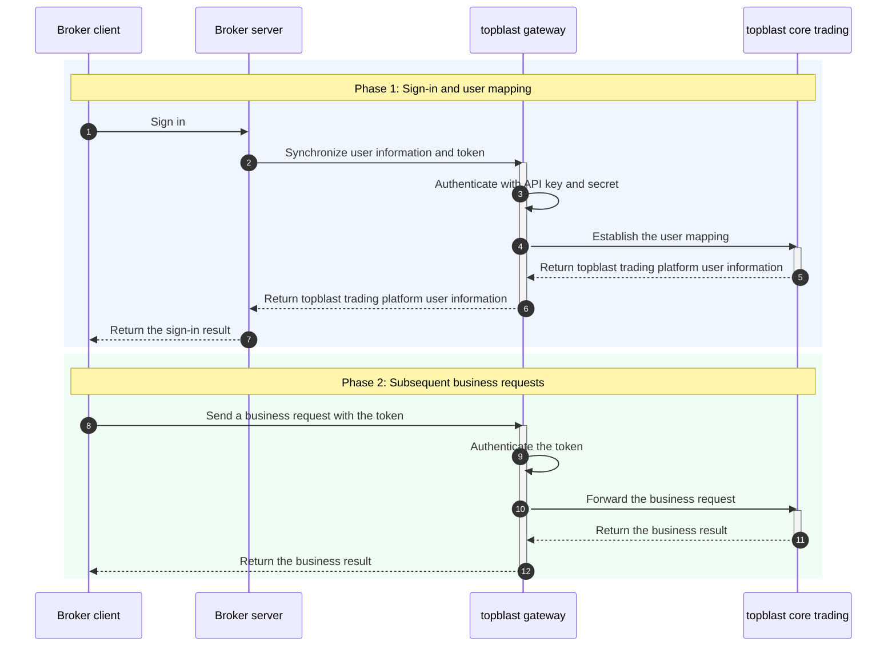

Welcome to topblast OpenAPI. This documentation is for brokers and partners integrating with the topblast trading platform from their servers. It explains Broker Management API authentication, the integration flow, and available capabilities.

## Capabilities

After integration, your broker server can use the Broker Management API to manage:

1. **Users**: Map broker users to topblast users, synchronize login tokens and logout state, update user details, create special accounts, and list users under the broker.
2. **Assets**: Create deposits or withdrawals, query transfer records and details, and retrieve user assets and balances.
3. **Trading**: Query trades, positions, and open orders, and perform actions such as canceling orders and closing positions.
4. **Reports**: Retrieve summary, trend, daily summary, and dashboard data for user growth, activity, fund flows, and trading volume.
5. **Events**: Query platform events and markets, and enable or disable events or individual markets for the broker.
6. **Risk management**: Query policies and exposures, and read or save global and event-level risk settings.

All endpoints use the `/broker/v2/*` prefix and must be called from the broker server. Requests are authenticated with an API key, timestamp, and HMAC-SHA256 signature and can access only data within the current broker's scope.

<Warning>
Store the API Secret on the broker server only. Never expose it to browsers, mobile clients, or end users.
</Warning>

## Prerequisites

Obtain a broker-level `API Key` and `API Secret` from topblast and confirm access to the test environment. Every request must include `x-api-key`, `x-timestamp`, and `x-signature`. See [Broker Management API authentication](/en/guide/authentication-b).

## User integration flow

After a broker user signs in, call `POST /broker/v2/user/login` from the broker server to synchronize the broker user ID and token with topblast. topblast automatically creates the mapping if it does not exist.

## API gateways

| Environment | Gateway |
| :--- | :--- |
| Development | `https://predict.xbit.trade` |
| Test | `https://apitest-predict.xbit.trade` |
| Production | Not available yet |

## Next steps

<CardGroup cols={3}>
  <Card title="Configure authentication" icon="key" href="/en/guide/authentication-b">Generate and verify Broker Management API signatures.</Card>
  <Card title="Synchronize a user" icon="user" href="/en/api-reference/broker/user/login">Review the complete login endpoint.</Card>
  <Card title="Create a transfer" icon="arrow-right-arrow-left" href="/en/api-reference/broker/transfer/create">Deposit or withdraw assets for a user.</Card>
</CardGroup>
