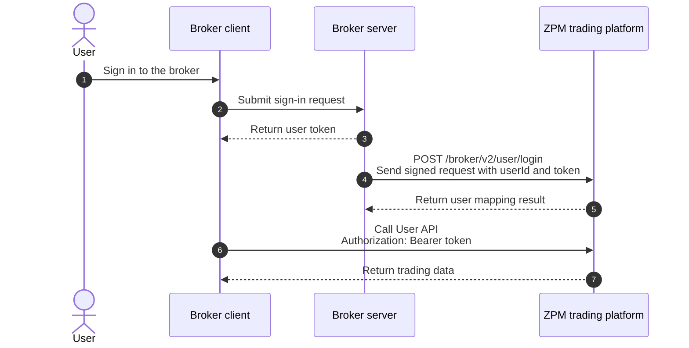

Welcome to the ZPM OpenAPI documentation. This guide is for brokers and partners integrating with the ZPM trading platform.

After completing the integration, you can:

1. **Synchronize users**: Map broker users to ZPM and synchronize their access tokens.
2. **Transfer assets**: Deposit or withdraw assets for broker users and query transfer records.
3. **Query and manage trading activity**: Query trades, positions, and orders, and perform actions such as canceling orders and closing positions.

## API types

ZPM provides two API types. Choose the authentication method based on the caller.

| API type | Path prefix | Caller | Authentication |
| :--- | :--- | :--- | :--- |
| Broker API | `/broker/v2/*` | Broker server | API key, timestamp, and HMAC-SHA256 signature |
| User API | `/api/v1/trade/*` | Authenticated end user | Bearer token |

<Warning>
Store the API secret on your broker server only. Never expose it to browsers, mobile clients, or end users.
</Warning>

## Prerequisites

Before testing, obtain a broker-level `API Key` and `API Secret` from ZPM and confirm that you can access the test environment.

Every Broker API request must include:

- `x-api-key`
- `x-timestamp`
- `x-signature`

See [Broker API authentication](/en/guide/authentication-b) for signing rules and a code example.

## Standard integration flow

After a user signs in to the broker, the broker server calls `POST /broker/v2/user/login` to synchronize the broker user ID and user token with ZPM. If the user mapping does not exist, ZPM creates it during login.



### 1. Synchronize the user and token

After the user signs in, call the following endpoint from the broker server:

```http
POST /broker/v2/user/login HTTP/1.1
Content-Type: application/json
x-api-key: <broker_api_key>
x-timestamp: <timestamp>
x-signature: <signature>

{
  "userId": "broker-user-10001",
  "userName": "alice",
  "email": "alice@example.com",
  "token": "<user_access_token>"
}
```

`userId` and `token` are required. `userId` is the user's unique identifier in the broker system. Other Broker APIs continue to use this identifier to locate the user.

<Note>
Calling the login endpoint again synchronizes the latest user information and token. When the user signs out of the broker, call `POST /broker/v2/user/logout` to synchronize the logout state.
</Note>

### 2. Transfer assets

Use `POST /broker/v2/transfer` to create a deposit or withdrawal. Each `txnId` must be unique so that the transfer can be queried and traced.

- `direction: 1` means deposit
- `direction: 2` means withdrawal
- Refer to [Create broker user transfer](/en/api-reference/broker/transfer/create) for the currently supported currencies

Use the [transfer list](/en/api-reference/broker/transfer/list) and [transfer detail](/en/api-reference/broker/transfer/detail) endpoints to query the result.

### 3. Call trading APIs

The user calls User APIs with the token synchronized during login:

```http
Authorization: Bearer <user_access_token>
```

User APIs provide spot and futures orders, fills, positions, and bills. See [User API authentication](/en/guide/authentication-c) for details. The broker server can also use [Broker trading APIs](/en/api-reference/broker/trade/trades) to query and manage its users' trading activity.

## API gateway

| Environment | Gateway |
| :--- | :--- |
| Test | `http://10.10.1.10:38008` |

Append an endpoint path to the gateway to create the full request URL. For example:

```text
http://10.10.1.10:38008/broker/v2/user/login
```

## Next steps

<CardGroup cols={3}>
  <Card title="Configure authentication" icon="key" href="/en/guide/authentication-b">
    Sign and verify Broker API requests.
  </Card>
  <Card title="Synchronize a user" icon="user" href="/en/api-reference/broker/user/login">
    Review the complete login endpoint definition.
  </Card>
  <Card title="Create a transfer" icon="arrow-right-arrow-left" href="/en/api-reference/broker/transfer/create">
    Deposit or withdraw assets for a broker user.
  </Card>
</CardGroup>
